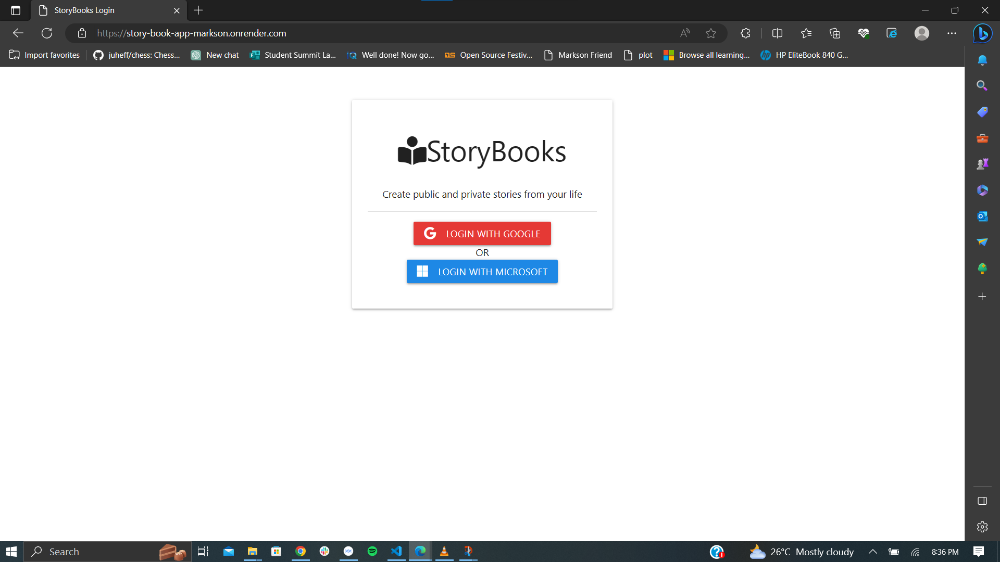
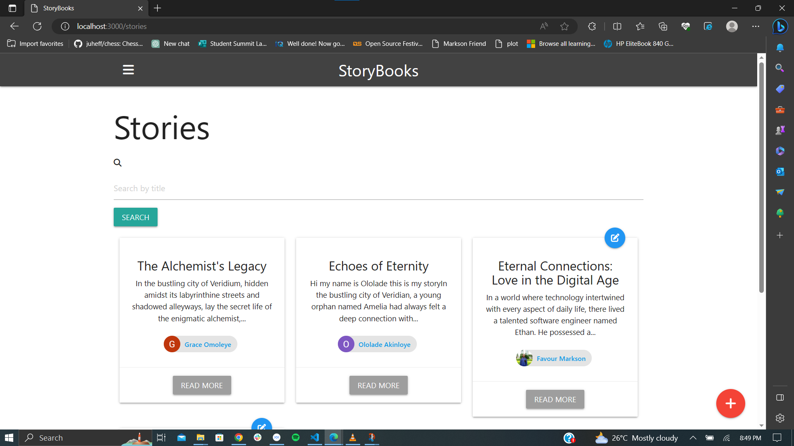

# StoryBooks App
This is a customized version of the StoryBooks Node.js application, originally developed from scratch by following the comprehensive tutorial "Node.js App From Scratch | Express, MongoDB & Google OAuth" on YouTube, created by Brad Traversy. Inspired by this insightful video, I delved into the world of Node.js and extended the application's functionality by implementing Microsoft OAuth authentication alongside the existing Google OAuth integration. This enhancement allows users to authenticate using their Microsoft accounts, adding another layer of flexibility to the authentication process.

## Tutorial Information
- Tutorial Title: Node.js App From Scratch | Express, MongoDB & Google OAuth
- YouTube Link: [Node.js App From Scratch | Express, MongoDB & Google OAuth - YouTube](https://www.youtube.com/watch?v=SBvmnHTQIPY)

## Screenshot of my deployed app

## Overview

StoryBooks is a CRUD (Create, Read, Update, Delete) application that allows users to create and manage their stories. It leverages Express as the framework, MongoDB as the database, and Handlebars as the template engine. The original implementation incorporated Google OAuth for user authentication. This modified version extends the authentication options to include Microsoft OAuth.

## Features

- User authentication with both Google OAuth and Microsoft OAuth
- Creation and management of public and private stories
- Addition of new pages to stories
- Persistent storage of user data, stories, and sessions in MongoDB

## Setup Instructions

1. Clone the repository or download the source code.
2. Install Node.js if you haven't already. Visit [nodejs.org](https://nodejs.org) to download and install Node.js.
3. Open the project in your preferred code editor.
4. Install the project dependencies by running the command `npm install` in the project's root directory.
5. Create a `.env` file in the `config` folder and add the following variables:
   - `PORT` - Set the desired port for running the application (e.g., 3000).
   - `MONGO_URI` - Set the MongoDB connection string obtained from MongoDB Atlas.
   - `GOOGLE_CLIENT_ID` - Set the Google Client ID obtained from the Google Developers Console.
   - `GOOGLE_CLIENT_SECRET` - Set the Google Client Secret obtained from the Google Developers Console.
   - `MICROSOFT_CLIENT_ID` - Set the Microsoft Client ID obtained from the Microsoft Azure portal.
   - `MICROSOFT_CLIENT_SECRET` - Set the Microsoft Client Secret obtained from the Microsoft Azure portal.
   - `MICROSOFT_CALLBACK_URL` - Set the callback URL for Microsoft OAuth authentication (e.g., `http://localhost:3000/auth/microsoft/callback`).
6. Start the application by running the command `npm start` or `npm run dev` (for development mode) in the project's root directory.
7. Access the application in your web browser using the specified port (e.g., `http://localhost:3000`).

Please ensure that you have followed the steps mentioned above and provided the necessary values for the environment variables in the `.env` file. The Google Client ID and Client Secret are required for Google OAuth authentication, while the Microsoft Client ID, Client Secret, and Callback URL are required for Microsoft OAuth authentication.

**Note:** This modified version of the StoryBooks app includes both Google OAuth and Microsoft OAuth authentication. The original application and the tutorial were created by Brad Traversy, and I extend my appreciation to him for his exceptional tutorial and guidance throughout this project.